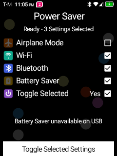

# TCL Flip 2 Power Saver Toggle

A compact, D-pad-friendly Android utility for rooted TCL Flip 2 phones. Power Saver can toggle any selected combination of Airplane Mode, Wi-Fi, Bluetooth, and Android Battery Saver, then reverse those selected changes on the next toggle.




## Features

- Select Airplane Mode, Wi-Fi, Bluetooth, and/or Battery Saver from an in-app configuration screen.
- Airplane Mode powers off cellular service while restoring unselected Wi-Fi and Bluetooth radios to their prior state.
- Restore selected Wi-Fi and Bluetooth radios to their normal on state on the reverse toggle.
- Arm selected Battery Saver while USB/external power is connected, then activate it automatically when external power is removed.
- Update Airplane Mode, Wi-Fi, Bluetooth, and Battery Saver status live while the app is open, including changes made through Android's native settings screens.
- Verify the requested system state and attempt rollback when verification fails.
- Keypad and D-pad navigation designed for the TCL Flip 2's 240×320 display.
- No analytics, network permission, advertising, or data collection.

## Requirements

- TCL Flip 2 or a compatible Android 11 device.
- Magisk or another `su` implementation that can grant root to apps.
- An explicit Superuser grant for Power Saver.

This app intentionally invokes protected Android shell commands as root:

- `svc wifi enable|disable`
- `svc bluetooth enable|disable`
- `cmd connectivity airplane-mode enable|disable`
- `cmd power set-mode 1|0`
- `settings get global ...` for state verification

Review the source before granting root. The app accepts no command text, paths, URLs, or shell arguments from intents or user input; shell commands are assembled only from internal boolean state.

## Install

1. Download `PowerSaver-v1.0.2.apk` from the [v1.0.2 release](https://github.com/jameswagar/TCL-Flip-2-Power-Saver-Toggle/releases/tag/v1.0.2).
2. Transfer and install it:

   ```sh
   adb install PowerSaver-v1.0.2.apk
   ```

3. Open **Power Saver** and approve the Magisk Superuser request.
4. Leave **Toggle Selected** set to **Yes** (the default), then move to a setting row and press the center/OK key to check or uncheck it. This only stages the item; it does not change the phone setting.
5. Move to **Toggle Selected Setting** or **Toggle Selected Settings** (depending on the selection count) and press the center/OK key to apply the checked group. Press it again to restore the same group.
6. Set **Toggle Selected** to **No** to gray out the bottom action and make the four setting rows operate as individual live toggles. Their live **On/Off** values appear only in this mode.

Selections can be edited while a group is active. Power Saver keeps a frozen copy of the active group for accurate restoration; edits become the next group. Turning **Toggle Selected** to **No** while the group is active restores the group and disables the mode in one step.

## Build from source

The build intentionally avoids Gradle. It requires:

- JDK with `javac`, `keytool`, and `java`
- Android SDK Platform 35 by default
- Android SDK Build Tools 35.0.0 by default
- `zip`, `shasum`, and either `openssl` or Python 3

```sh
./test.sh
./build.sh
```

The APK is written to `dist/PowerSaver-v1.0.2.apk`.

On the first build, the script creates a local signing keystore and a random signing password. Both are excluded by `.gitignore`. Preserve them securely if you want future builds to update an already-installed copy. You can instead provide:

- `POWER_SAVER_KEYSTORE`
- `POWER_SAVER_KEY_ALIAS`
- `POWER_SAVER_STOREPASS`
- `POWER_SAVER_KEYPASS`

Build tools/platforms can be overridden with `BUILD_TOOLS_VERSION` and `ANDROID_PLATFORM_VERSION`.

## Test

```sh
./test.sh
```

The host-side tests cover reversible Airplane Mode and radio planning, staged and active selections, individual/group interaction, charging and deferred Battery Saver behavior, shell construction and ordering, verification markers, and rollback construction.

## Safety notes

- Root access can change protected device settings. Use at your own risk.
- The app is tested for the TCL Flip 2 on Android 11; behavior may differ on other firmware.
- Battery Saver can be selected while external power is detected. Applying it arms a private deferred request; an unplug broadcast activates Battery Saver through Magisk even when the app is closed. Restoring the group disarms the request and only disables Battery Saver when this app enabled it.
- Bluetooth transitions are asynchronous; the UI listens for Android state broadcasts and updates when the final state arrives.
- Airplane Mode itself is verified immediately; Wi-Fi/Bluetooth stabilization continues briefly in the background and the visible row states update from Android broadcasts.
- When Airplane Mode is selected, separately selected Wi-Fi or Bluetooth rows still turn those radios off; unselected radios retain their prior state.
- **Toggle Selected** defaults to **Yes**. Setting it to **No** disables the bottom group action, reveals the settings' live **On/Off** column, and restores individual row toggles. In individual mode the full-strength checkboxes track each power-saving action; saved group membership reappears when the mode returns to **Yes**.
- App preferences are stored privately and Android backup is disabled.

## Privacy

Power Saver contains no network permission and sends no telemetry. It does not collect device identifiers, accounts, contacts, messages, location, or usage data.

## Contributing

Forks are welcome. This repository does not accept issues or pull requests; see [CONTRIBUTING.md](CONTRIBUTING.md).

## License

MIT. See [LICENSE](LICENSE).
